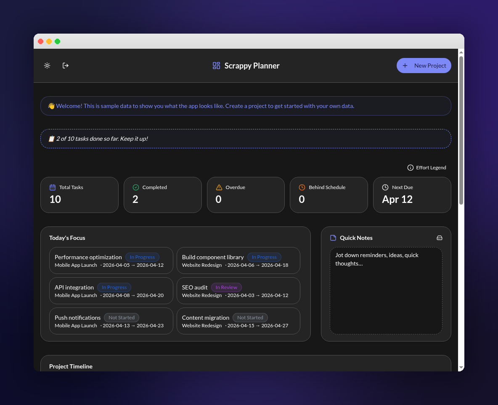

# Scrappy Planner

> A compact way to quickly organize daily work — without overcomplicating things.

Scrappy Planner is built for people who want a no-nonsense task tracker that stays out of the way. No bloated feature sets, no endless configuration — just projects, tasks, timelines, and a clear view of what needs your attention today.

This is built using Loveable



## Features

- **Login** - A login page so each account has its own view and data stored locally
- **Dashboard** — At-a-glance overview with a conversational status summary that tells you where you stand
- **Task Management** — Create, edit, and bulk-edit tasks with parent/child relationships; child status automatically rolls up to parents
- **Gantt Charts** — Visualize project timelines across fiscal quarters
- **Today's Focus** — See in-progress and overdue tasks front and center
- **Quick Notes** — Jot down thoughts that persist across sessions
- **Dark / Light Mode** — Toggle between themes
- **Authentication** — Secure login with Google OAuth support

## Tech Stack

- React 18 + TypeScript
- Vite
- Tailwind CSS + shadcn/ui
- Recharts
- Lovable Cloud (database, auth, storage)

## Getting Started

```sh
git clone <YOUR_GIT_URL>
npm install
npm run dev
```

## Live

[scrappy-planner.lovable.app](https://scrappy-planner.lovable.app)
